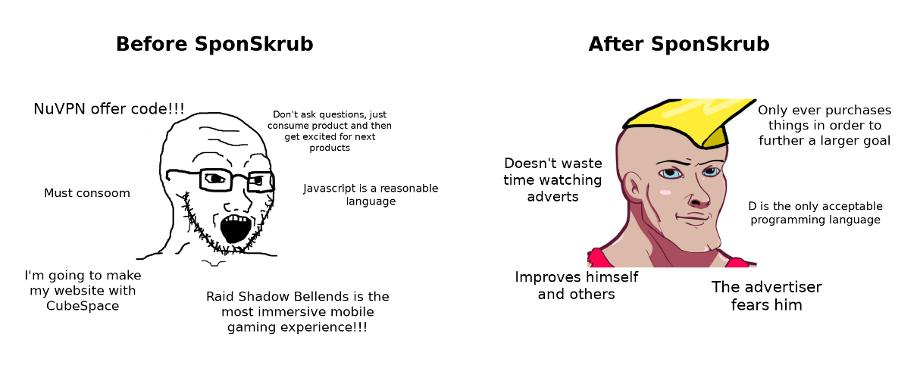

# SponSkrub
This is a command line utility to strip out in video YouTube advertisements from downloaded YouTube videos, such as those downloaded from [youtube-dl](https://ytdl-org.github.io/youtube-dl/index.html). This means that you both don't waste disk space on adverts and don't redistribute adverts. If you want to download and strip a video you can use the wrapper application `youtube-dl-sponsorblock` which uses youtube-dl to download the video and will then strip the video of sponsors for you. 

It makes use of the [SponsorBlock API](https://github.com/ajayyy/SponsorBlockServer#api-docs) and I'd recommend installing the extension and maybe contributing some sponsorship times when you're ever bored.  
You can build `youtube-dl-sponsorblock` and `sponskrub` by running `dub build`, to build only one of them use `dub build :youtube-dl-sponsorblock` and `dub build :sponskrub` respectively.

